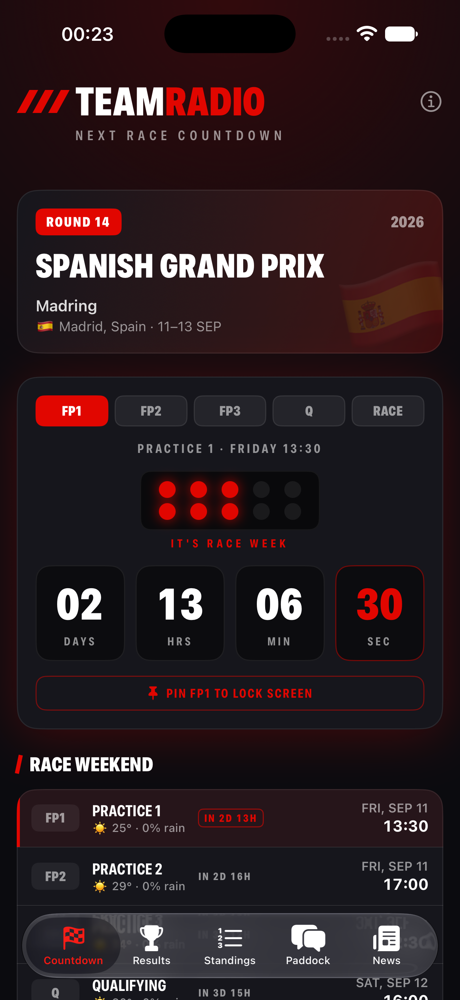
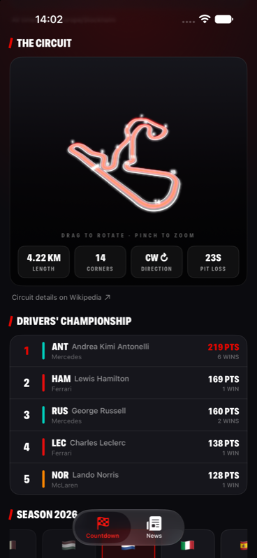
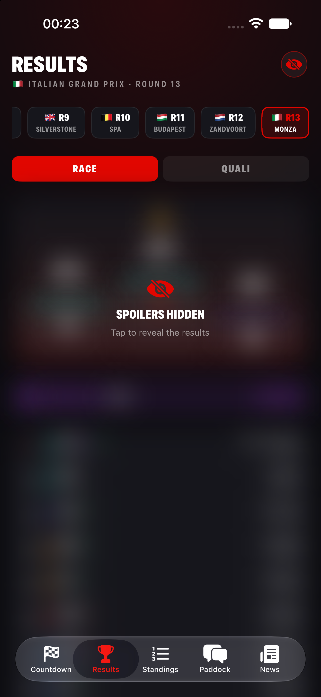
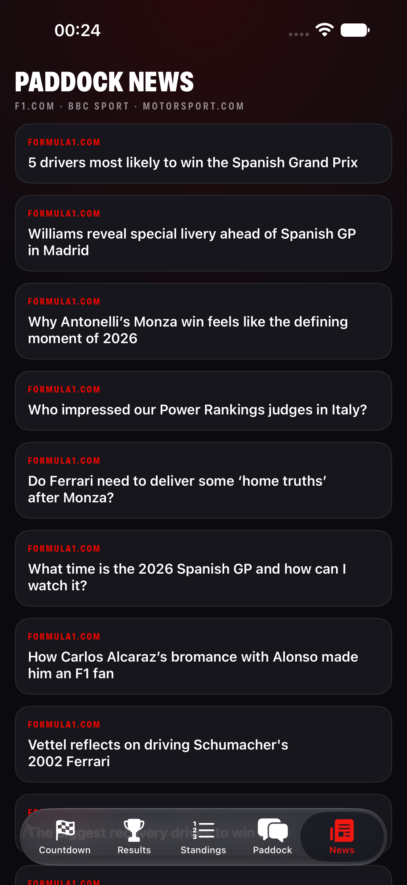

# OneF 🏎️

**A fast, F1-broadcast-inspired iOS app: countdowns to every session of the next Grand Prix, an interactive 3D circuit map, full race results, and live paddock news.**

Built entirely with SwiftUI and SceneKit — no dependencies, no packages, just one clean target.

<p align="center">
  
  
  
  
</p>

## Features

### ⏱️ Countdown
- **A countdown for every session** — tap any chip (FP1, Sprint Quali, Sprint, Qualifying, Race) to target it; defaults to the next session that hasn't started, with live and complete states
- **Start-light gantry** that progressively lights up through race week — all five burn in the final 24 hours
- **Race weekend timetable** in your local timezone with a mini-countdown on every row and a pulsing LIVE indicator during sessions
- **Sprint weekend detection** with its own badge
- **Drivers' championship top 5** with constructor color bars, and the **full season strip** auto-scrolled to the next round

### 🌀 The Circuit in 3D
- The **real track centerline** (664+ measured points per circuit) rendered as a 3D ribbon in SceneKit with a glowing racing line, corner-number markers, and the start/finish gate
- **Auto-rotates** — drag to orbit, pinch to zoom
- Stats derived from the actual geometry: **track length**, **corner count**, **direction of travel**, and **pit-lane time loss**

### 🏆 Results
- **Last Grand Prix classification** with a podium visualization, gaps, points, fastest-lap highlight, and grid-delta arrows showing positions gained or lost
- **Qualifying mode** with each driver's best time and the segment it came from (Q1/Q2/Q3)

### 🔢 Standings
- **Complete championships** — every driver and every constructor, with car numbers, wins, points, and gap to the leader

### 📰 Paddock News
- Latest F1 stories aggregated from **Formula1.com, BBC Sport, and Motorsport.com** RSS feeds — merged, deduplicated, sorted newest-first, with thumbnails
- No API keys, no accounts

## Data sources

| Source | Used for |
|---|---|
| [Jolpica F1 API](https://github.com/jolpica/jolpica-f1) | Race calendar, session times, standings, results, qualifying |
| [MultiViewer circuits API](https://api.multiviewer.app) | Track centerline geometry, corners, pit loss |
| F1.com / BBC / Motorsport.com RSS | News stories |

All free, no keys required. OpenF1 was considered but is pay-walled during live sessions — exactly when an F1 app gets opened.

## Architecture

```
OneF/
├── OneFApp.swift                   # entry point + TabView
├── Theme.swift                     # palette, typography, team colors, flags
├── Models/
│   ├── F1Models.swift              # Codable models for the Ergast/Jolpica schema
│   ├── TrackMap.swift              # circuit geometry + derived length/direction
│   └── NewsItem.swift
├── Services/
│   ├── F1API.swift                 # async Jolpica client
│   ├── TrackAPI.swift              # MultiViewer client + circuitId→key map
│   └── NewsService.swift           # concurrent RSS aggregation + parser
├── ViewModels/
│   ├── RaceViewModel.swift         # @Observable, async-let fan-out
│   ├── ResultsViewModel.swift
│   ├── StandingsViewModel.swift
│   └── NewsViewModel.swift
└── Views/
    ├── ContentView.swift           # countdown tab layout
    ├── CountdownView.swift         # selectable session countdown + gantry
    ├── RaceHeroView.swift
    ├── WeekendScheduleView.swift   # timetable + per-row mini countdowns
    ├── Track3DView.swift           # SceneKit scene built from real coordinates
    ├── TrackSectionView.swift
    ├── StandingsView.swift
    ├── SeasonView.swift
    ├── ResultsView.swift           # podium, classifications, constructors
    ├── StandingsTabView.swift      # full drivers' and constructors' tables
    └── NewsView.swift
```

- Swift / SwiftUI / SceneKit, iOS 17+
- `@Observable` + structured concurrency (`async let`, `withTaskGroup`)
- `TimelineView` drives all countdowns — no timers to manage
- The 3D track ribbon is explicit triangle-strip geometry offset from the centerline, so rendering is deterministic on every circuit
- Zero third-party dependencies

## Running it

1. Open `OneF.xcodeproj` in Xcode 16 or newer
2. Pick any iOS 17+ simulator or device
3. `⌘R`

## Roadmap ideas

The Jolpica API also serves lap-by-lap times and pit stop data — material for race strategy visualizations (stint charts, position graphs) down the road.

## License

MIT — see [LICENSE](LICENSE).

*OneF is an unofficial hobby project and is not associated in any way with Formula 1, the FIA, or any F1 team.*
