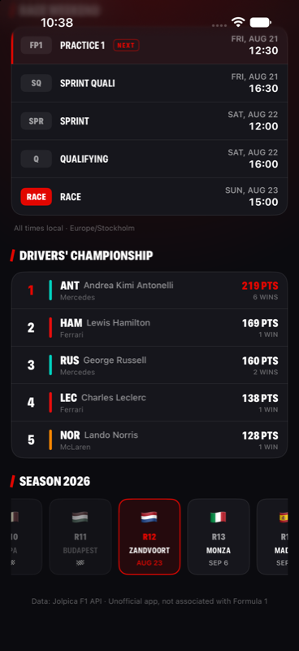

# OneF 🏎️

**A tiny, fast, F1-broadcast-inspired iOS app that counts down to the next Formula 1 Grand Prix.**

Built entirely with SwiftUI — no dependencies, no packages, just one clean target.

<p align="center">
  
  
</p>

## Features

- ⏱️ **Live countdown** to lights out, ticking every second with animated numeric transitions
- 🚦 **Start-light gantry** that progressively lights up through race week — all five burn in the final 24 hours
- 🏁 **Race weekend timetable** — every session (FP, Sprint Quali, Sprint, Qualifying, Race) converted to your local timezone, with past sessions crossed off and the next one flagged
- 🥇 **Drivers' championship top 5** with constructor color bars, points, and wins
- 🗓️ **Full season strip** — auto-scrolls to the next round; completed rounds get the checkered flag
- ⚡ **Sprint weekend detection** with its own badge
- 🌑 F1-broadcast dark theme: carbon black, F1 red `#E10600`, heavy condensed italics

## Data

All data comes live from the free [Jolpica F1 API](https://github.com/jolpica/jolpica-f1)
(the community successor to the retired Ergast API). No API key needed.

| Endpoint | Used for |
|---|---|
| `/ergast/f1/current/next.json` | Next race + weekend session times |
| `/ergast/f1/current.json` | Full season calendar |
| `/ergast/f1/current/driverstandings.json` | Championship standings |

## Architecture

```
OneF/
├── OneFApp.swift            # entry point
├── Theme.swift              # palette, typography, team colors, flag emoji
├── Models/F1Models.swift    # Codable models for the Ergast/Jolpica schema
├── Services/F1API.swift     # thin async/await API client
├── ViewModels/RaceViewModel.swift  # @Observable state, concurrent loading
└── Views/                   # ContentView, CountdownView, RaceHeroView,
                             # WeekendScheduleView, StandingsView, SeasonView
```

- Swift / SwiftUI, iOS 17+
- `@Observable` + structured concurrency (`async let` fan-out for the three API calls)
- `TimelineView` drives the per-second countdown — no timers to manage
- Zero third-party dependencies

## Running it

1. Open `OneF.xcodeproj` in Xcode 16 or newer
2. Pick any iOS 17+ simulator or device
3. `⌘R`

## License

MIT — see [LICENSE](LICENSE).

*OneF is an unofficial hobby project and is not associated in any way with Formula 1, the FIA, or any F1 team.*
